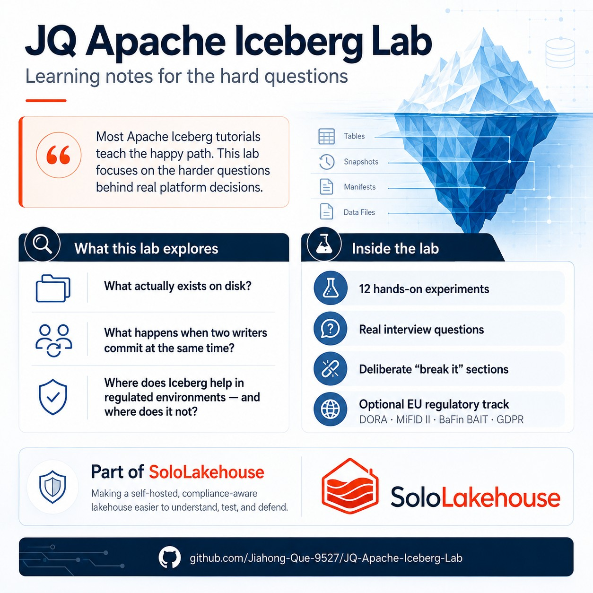

# JQ Apache Iceberg Lab

> Twelve hands-on experiments that take you from "never touched Iceberg" to "can defend Iceberg architecture in a senior data engineer interview" — built around **real interview questions**, with a deliberate **"Break it"** section in every experiment, and an optional **EU regulatory track** (DORA, BaFin/BAIT, MiFID II, GDPR) you won't find in any other Iceberg tutorial.

[](LICENSE)
[](https://creativecommons.org/licenses/by-sa/4.0/)
[](#)
[](#)

<p align="center">
  
</p>

**⭐ If this saves you time, please star the repo — it helps others find the material.**

---

## Why this exists

Most Iceberg tutorials show commands. This one is built to help you explain the architecture in a senior data-engineering interview.

Every experiment starts with an interview question, walks through hands-on work, then asks you to deliberately break something. Several experiments also add an optional EU finance angle: DORA, BaFin/BAIT, MiFID II, and GDPR.

---

## Who this is for

- **Data engineers** preparing for lakehouse or Iceberg interviews
- **Engineers** moving from Hive or legacy warehouses to open table formats
- **EU FinTech teams** who need regulatory context alongside table-format mechanics
- **Readers of the Iceberg docs** who still want hands-on confidence

This is a **learning sandbox**, not a production deployment guide. For canonical behavior and APIs, see the [Apache Iceberg documentation](https://iceberg.apache.org/docs/).

---

## What's in this repo

| Path | Purpose | Status |
| --- | --- | --- |
| [`experiments/`](experiments/) | Twelve guided experiments | ✅ Available |
| [`experiments/README.md`](experiments/README.md) | Series index and interview questions | ✅ Available |
| [`docs/iceberg-lab-spec.md`](docs/iceberg-lab-spec.md) | Build spec for the local sandbox | ✅ Available |
| [`docs/operation-guide.md`](docs/operation-guide.md) | Step-by-step runbook for setup, reset, cleanup, and troubleshooting | ✅ Available |
| [`lab/`](lab/) | Docker Compose + Jupyter notebooks + PyIceberg helpers | ✅ Runnable |

The experiments run against the local sandbox under [`lab/`](lab/), the official [Iceberg quickstart docker-compose](https://iceberg.apache.org/spark-quickstart/), or an existing Iceberg setup.

---

## Time investment

| Path | Duration | Outcome |
| --- | --- | --- |
| **Crunch path** (experiments 01, 02, 04, 05, 07, 09) | ~1 week part-time | Bar for mid-level Iceberg interviews |
| **Full Foundation + Mechanics** (01–08) | ~2 weeks part-time | Bar for senior generalist roles |
| **Full series including specialization** (01–12) | ~3 weeks part-time | Bar for senior platform roles, with EU FinTech differentiation |

Each experiment runs 60-120 minutes.

---

## The interview questions this prepares you for

The series covers 30 questions across physical layout, manifests, catalogs, transactions, schema evolution, partition evolution, concurrent writers, small files, snapshot expiry, format tradeoffs, and EU regulatory use cases.

See the [full question list](experiments/README.md).

---

## Quick start

New here? Start with [`docs/operation-guide.md`](docs/operation-guide.md) — the end-to-end runbook from clone through your first notebooks, the experiment loop, reset, shutdown, and common fixes. The steps below are the short version; use the guide when you want the full workflow, MinIO/catalog inspection, and cleanup options.

### 1. Start the local lab

```bash
cd lab
./init.sh
```

Then open:

- JupyterLab: http://localhost:8888
- MinIO console: http://localhost:9001
- MinIO login: `minioadmin` / `minioadmin`

Start with `notebooks/00_setup_check.ipynb`, then `notebooks/01_basics.ipynb`, then `notebooks/02_metadata_anatomy.ipynb`.

### 2. Reset the lab

```bash
cd lab
./reset.sh --confirm
```

Reset deletes `lab/warehouse/` and `lab/catalog.db`, then recreates MinIO and Jupyter. Runtime state is gitignored.

### 3. Open the experiment series

→ [`experiments/README.md`](experiments/README.md)

### 4. Set up your personal interview FAQ

Create a local file called `interview-faq.md`. For each experiment, write your answer to the interview question **before** doing the hands-on work, and again **after**. This testing-effect loop is what makes the series stick.

### 5. Start with Experiment 01

→ [`experiments/01-first-table.md`](experiments/01-first-table.md)

---

## How the experiments are structured

Every experiment follows the same loop:

1. 🎯 Read the **interview question** and write your current answer
2. 🛠️ Do the **hands-on** section (type, don't paste — your fingers learn what your eyes skip)
3. 💥 Do the **Break it** section
4. 📚 Read the **theory deep-dive** with concrete behavior in mind
5. ✍️ **Re-answer** the interview question and compare to your draft
6. 🎁 (Optional) Adapt the included **LinkedIn post draft** to publish what you learned

### Tier structure

| Tier | Experiments | What you'll be able to do |
| --- | --- | --- |
| **Foundation** | 01–04 | Explain Iceberg's physical layout, query plan, and catalog model from memory |
| **Mechanics** | 05–08 | Defend Iceberg's behavior under schema change, partition evolution, and concurrent writes |
| **Production** | 09–11 | Operate Iceberg at scale: small files, GC, format selection |
| **Specialization** | 12 | Defend Iceberg as a compliance architecture choice for EU regulated environments |

Experiments **02, 05, 09, 10, and 12** include optional 🇪🇺 regulatory angle sections.

---

## EU regulatory track (the differentiator)

Optional regulatory sections appear in experiments **02, 05, 09, 10, and 12**. They connect Iceberg mechanics to common EU finance interview topics:

| Regulation | Article / Section | Iceberg mechanism covered |
| --- | --- | --- |
| **DORA** | Art. 9 (integrity, traceability) | Snapshot summaries, manifest checksums (exp 02) |
| **DORA** | Art. 28 (ICT third-party risk, portability) | Open spec, multi-engine reads (exp 02, 11) |
| **MiFID II** | RTS 22 (transaction reporting fields) | Schema with documented field-ids + table property tagging (exp 12) |
| **MiFID II** | RTS 25 (reproducibility) | End-of-day snapshot tagging + time travel (exp 05, 12) |
| **BaFin BAIT** | Access controls | Catalog-level RBAC (exp 03) |
| **GDPR** | Art. 17 (right to erasure) | Redaction workflow + retention policy (exp 10, 12) |

Use this track if you are targeting EU FinTech, banking, or regulated-data roles.

---

## Local sandbox architecture

The [`lab/`](lab/) directory provides a lightweight local environment:

```
┌─────────────────────────────────────────────┐
│  Host machine                               │
│  ┌──────────────────────────────────────┐   │
│  │  JupyterLab (Python 3.11)            │   │
│  │  PyIceberg · DuckDB · PyArrow        │   │
│  └─────────────┬────────────────────────┘   │
│                │                            │
│  ┌─────────────┴──────────┐                 │
│  │  catalog.db (SQLite)   │                 │
│  └─────────────┬──────────┘                 │
│  ┌─────────────┴──────────┐                 │
│  │  MinIO (Docker)        │                 │
│  │  bucket: warehouse     │                 │
│  └────────────────────────┘                 │
└─────────────────────────────────────────────┘
```

**Design goals:** fast warm start · full reset < 10s after images are built · no JVM · localhost-only ports.

**Security note:** Jupyter runs without a token/password for local frictionless learning. Ports are bound to `127.0.0.1` only. Do not expose this compose setup on a networked host.

For day-to-day operations — stopping containers, full cleanup, and troubleshooting — see [`docs/operation-guide.md`](docs/operation-guide.md).

Full specification: [`docs/iceberg-lab-spec.md`](docs/iceberg-lab-spec.md).

---

## License

- Code in `lab/`: [MIT](LICENSE)
- Tutorials and specs under `experiments/` and `docs/`: [CC BY-SA 4.0](https://creativecommons.org/licenses/by-sa/4.0/)

You are free to use this material for personal learning, team training, internal workshops, or as the basis for derivative tutorials — provided you give attribution and share derivatives under the same license.

---

## About the author

Built by **Jiahong Que** — PhD candidate in deep learning applied to aviation operations, builder of [SoloLakehouse](https://github.com/) (a self-hosted, compliance-first lakehouse for EU FinTech), based in Frankfurt am Main.

I write at the intersection of modern data platforms, EU financial regulation, and platform engineering. If this material helped you, the most useful things you can do are:

- ⭐ **Star the repo** so others can find it
- 💬 **Open an issue** with what worked or what confused you
- 🤝 **Connect on [LinkedIn](https://www.linkedin.com/)** — I'm especially happy to talk with engineers and hiring managers at Frankfurt-area FinTechs, EU banks, or anyone building compliance-aware data platforms

If you're hiring for platform engineering or senior data engineering roles in Frankfurt or remote-EU, [I'd love to hear from you](https://www.linkedin.com/).

---

*Last updated: May 2026 · Apache Iceberg version targeted: 1.5+ / spec v2*
